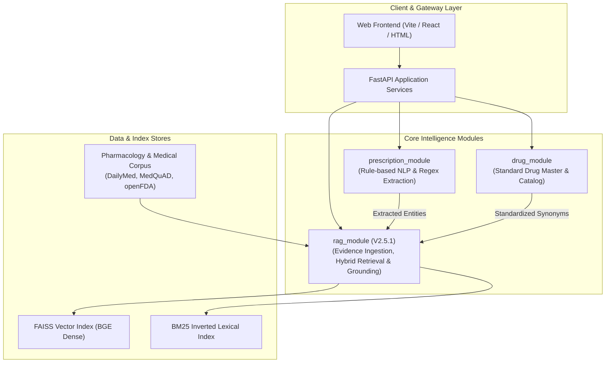

# SYSTEM ARCHITECTURE — HEALTHCARE PLATFORM

## 1. System Overview & Component Topology

The platform follows a modular, service-oriented architecture designed to separate deterministic extraction and validation from probabilistic semantic retrieval.



---

## 2. Core Modules & Responsibilities

### 2.1 `prescription_module`
* **Purpose**: Parse unstructured clinical prescription text and extract standardized prescription entities.
* **Pipeline**:
  1. Input clinical text $\to$ Text normalizer.
  2. Rule-based Regex and EntityRuler matcher $\to$ Drug name, dosage strength, form, frequency, duration, route.
  3. Output structured medication payload (`drug_name`, `dosage`, `frequency`, `duration`).

### 2.2 `drug_module`
* **Purpose**: Master pharmacological reference repository and vocabulary normalizer.
* **Capabilities**: Generic-to-brand mapping, ATC classification cross-reference, formulation verification.

### 2.3 `rag_module`
* **Purpose**: Modular evidence retrieval engine providing verified clinical literature and drug monographs.
* **Architecture**: Self-contained ingestion adapters, canonical `KnowledgeDocument`/`KnowledgeChunk` data contracts, dual-index hybrid retrieval (FAISS Dense + BM25 Lexical via RRF), context assembly with citations, safety guardrails, and LLM synthesis.

---

## 3. Data Flow & Inter-Module Integration

### Clinical Inquiry Workflow
1. **Prescription Parsing**: User enters prescription text (e.g., *"Metformin 500mg PO BID with meals"*). `prescription_module` extracts:
   ```json
   {
     "drug": "Metformin",
     "strength": "500mg",
     "route": "Oral",
     "frequency": "Twice daily"
   }
   ```
2. **Entity Harmonization**: `drug_module` resolves the generic entity name and flags relevant interaction categories.
3. **Evidence Retrieval**: `rag_module` queries the pharmacology index using hybrid retrieval (Dense + BM25) filtered by `source_id: DailyMed` and `medical_domain: pharmacology`.
4. **Context Construction & Citation**: Retrieved chunks (e.g., *Boxed Warning: Lactic Acidosis*, *Dosage & Administration*) are formatted into citation-bearing context strings.
5. **Safety Verification**: Response provides grounded clinical evidence with clickable provenance URLs and section tags.

---

## 4. Separation of Concerns & Safety Boundary

| Responsibility | Owning Subsystem | Rationale |
| :--- | :--- | :--- |
| **Deterministic Extraction** | `prescription_module` | Regex and exact vocabulary matching guarantee reproducible entity extraction without LLM hallucinations. |
| **Drug Vocabulary Authority** | `drug_module` | Centralized drug catalog prevents terminology divergence across modules. |
| **Evidence Grounding** | `rag_module` | Dual-retrieval indexes official FDA/NIH sources to supply verified text citations. |
| **Clinical Decision Logic** | **Physician / Clinician** | The system acts as reference intelligence; human clinician remains the sole decision authority. |

---

## 5. Current Architecture vs. Planned Integration

* **Current State (V2.5.1)**: All three modules (`rag_module`, `prescription_module`, `drug_module`) exist as standalone Python packages with independent test suites.
* **Target State (V2.6+)**: Direct API integration where `prescription_module` output triggers automated `rag_module` safety and contraindication evidence lookups.
