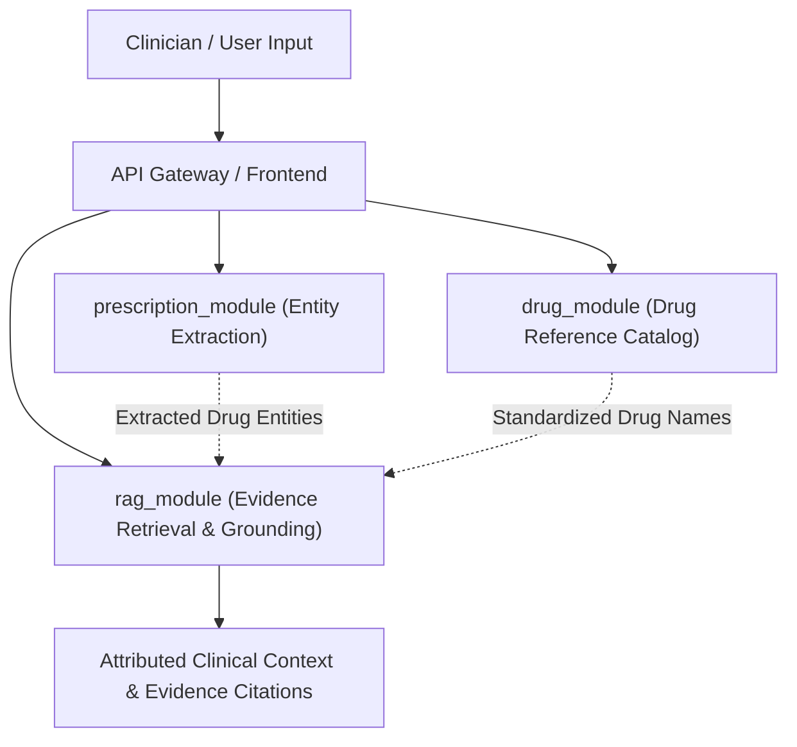

# PROJECT CONTEXT — HEALTHCARE AI PLATFORM & RAG ENGINE

## 1. Project Purpose & Scope

This repository houses a **4th-year Computer Engineering major project**: an intelligent, evidence-grounded **Healthcare AI Platform**.

The platform is designed to assist clinical workflows by combining deterministic rule-based medical extraction with a modular, provenance-preserving **Retrieval-Augmented Generation (RAG)** intelligence layer.

### Primary Objectives
1. **Prescription Parsing & Entity Extraction**: Extract structured medication details (drug names, dosages, frequencies, routes, durations) from unstructured clinical text.
2. **Evidence-Grounded Clinical Retrieval (RAG)**: Retrieve verified, authoritative medical literature and FDA-approved drug monographs to answer clinical inquiries with strict attribution.
3. **Safety & Contraindication Verification**: Provide transparent evidence trails for dosage limits, drug-drug interactions, and boxed warnings.

---

## 2. Major Modules & System Scope

The platform is organized into three core backend modules alongside a web user interface:

| Module | Core Responsibility | Primary Technologies | Current Integration Status |
| :--- | :--- | :--- | :--- |
| **`rag_module`** | Knowledge ingestion, semantic/lexical retrieval, RRF fusion, context building, and LLM answer generation. | Python, BGE Embeddings, FAISS, BM25, FastAPI, HuggingFace Transformers | **Active Foundation (V2.5.1)** — Modular, audited, 42 tests passing. |
| **`prescription_module`** | Rule-based and NLP extraction of prescription entities (drugs, strengths, frequencies, routes). | Python, spaCy / Regex / Rule-based NLP, FastAPI | **Active Baseline** — Independent module with standalone test suite. |
| **`drug_module`** | Drug master catalog, synonym mapping, and pharmacological reference lookup. | Python, JSON data catalogs | **Active Baseline** — Reference data source for entities. |
| **`frontend`** | Web user interface for prescription entry, interaction review, and RAG search. | JavaScript, HTML, CSS / React | **UI Prototype** — In active development. |

---

## 3. Intended Users & Clinical Context

* **Primary Users**: Clinicians, pharmacists, healthcare researchers, and medical students seeking fast, attributed reference evidence during workflow tasks.
* **Operational Boundary**: This system is an **engineering and research prototype**. It is **NOT** a certified medical device and is **NOT** intended for autonomous diagnostic or treatment decisions without physician oversight.

---

## 4. Architectural Boundaries & Non-Goals

### Critical Non-Goals
* **No Autonomous Clinical Decision Making**: The RAG layer provides *evidence retrieval and context presentation*, not autonomous prescription modifications.
* **No Unbounded General LLM Chat**: Queries outside medical and pharmacological domains or involving acute emergency crisis prompts are intercepted by safety guardrails.
* **No Black-Box Retrieval**: Every retrieved chunk and generated response must preserve strict provenance (source ID, document ID, publisher, URL, section).

### Subsystem Relationships

---

## 5. Security, Privacy & Healthcare Compliance Baseline

1. **Secret & Key Isolation**: No hardcoded API keys or proprietary credentials in codebase; environment variables managed via `.env`.
2. **PII / PHI Handling**: System operates on de-identified prescription text and public medical literature (MedQuAD, DailyMed, openFDA).
3. **Traceability & Grounding**: Context builder formats citations with source set IDs and clinical sections to prevent ungrounded model hallucination.
