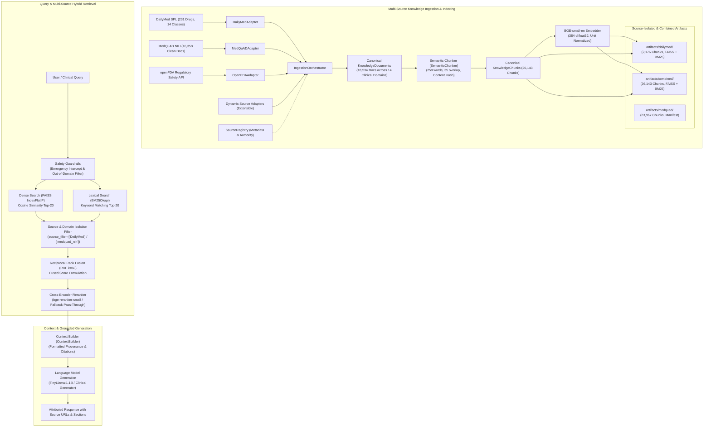
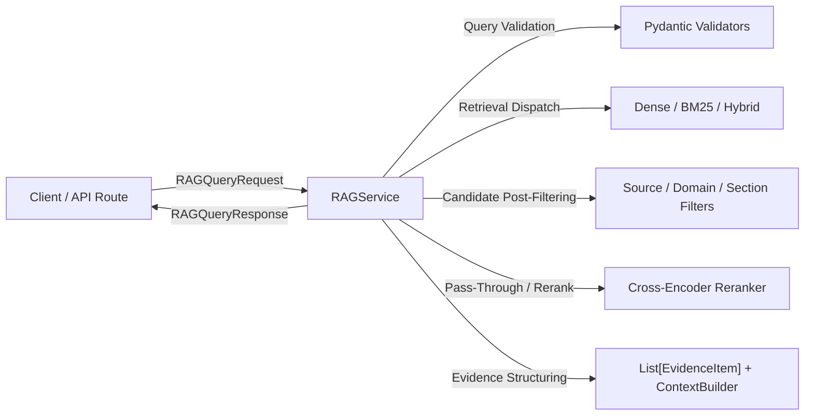

# RAG MODULE V2.6-A — TECHNICAL ARCHITECTURE SPECIFICATION

## 1. End-to-End Pipeline Architecture

The `rag_module` is a modular, evidence-grounded clinical retrieval and generation pipeline.



---

## 2. Knowledge Ingestion Architecture

### 2.1 Canonical Data Contracts (`rag_module/knowledge/document_model.py`)

#### `KnowledgeDocument`
Represents an atomic medical document extracted from an authoritative source.
* `document_id`: Unique identifier (e.g., `dailymed_4b2c1256..._boxed_warning`).
* `source_id`: Source identifier (e.g., `DailyMed`, `medquad_nih`, `openFDA`).
* `source_name`: Full descriptive name (e.g., `National Library of Medicine DailyMed`).
* `publisher`: Authoritative publisher (e.g., `U.S. National Library of Medicine / FDA`).
* `title`: Canonical document title.
* `content`: Full textual content.
* `document_type`: Enum (`drug_monograph`, `qa_pair`, `clinical_guideline`, `reference_article`).
* `medical_domain`: Domain (`pharmacology`, `general_medicine`, `pediatrics`, `oncology`, etc.).
* `section`: Clinical section name (*Boxed Warning, Indications, Dosage & Administration, Contraindications, Warnings, Adverse Reactions, Drug Interactions, Specific Populations, Overdosage, Clinical Pharmacology*).
* `source_url`: Verifiable web link.
* `content_hash`: SHA-256 digest of content for exact deduplication.
* `metadata`: Key-value payload (generic name, brand names, active ingredient, NDC code, SPL set ID).

#### `KnowledgeChunk`
Represents an individual retrieval unit generated by `SemanticChunker`.
* `chunk_id`: Standardized chunk key (`<document_id>-c<index>`).
* Inherits all parent document provenance attributes.
* `text`: Passage-formatted text with contextual header (`Drug: ...\nSection: ...\n\n...`).
* `chunk_index`, `word_count`, `char_count`, `content_hash`.

### 2.2 Source Adapter Engine (`rag_module/ingestion/adapters/`)
* **`BaseSourceAdapter`**: Abstract base defining `load_raw()`, `normalize_document()`, `validate_document()`, `deduplicate()`, `generate_manifest()`, and `run()`.
* **`SourceRegistry`**: Central declarative registry tracking active and extensible adapters.
* **`IngestionOrchestrator`**: Coordinates multi-source extraction, validation, chunking, artifact serialization, and `combine_sources()` aggregation.

---

## 3. Retrieval Architecture

### 3.1 Dual-Index Deployment Pattern
1. **Source-Isolated DailyMed Index** (`artifacts/dailymed/`):
   * Dedicated FAISS vector index ($N=2,176$) and BM25 index.
   * Tailored for high-speed, zero-noise prescription safety queries ($<1$ ms latency).
2. **Unified Production Index** (`rag_module/data/faiss_index/`):
   * Comprehensive multi-source FAISS vector index ($N=26,143$) and BM25 index.
   * Supports global medical search with optional `source_filter` and `domain_filter`.

### 3.2 Dense Semantic Retrieval (`rag_module/retrieval/dense_retriever.py`)
* **Embedding Model**: `BAAI/bge-small-en` (384 dimensions).
* **Query Formatting**: Prefixed with `Represent this sentence for searching relevant passages: ` as specified by BGE model guidelines.
* **Vector Index**: `faiss.IndexFlatIP` calculating exact inner product over $L_2$-normalized vectors (equivalent to exact cosine similarity).

### 3.3 Lexical Retrieval (`rag_module/retrieval/bm25_retriever.py`)
* **Algorithm**: BM25Okapi ($k_1=1.5, b=0.75$).
* **Tokenizer**: Custom medical tokenizer preserving numbers, dosages, hyphens, and drug codes: `\b[a-zA-Z0-9_-]+\b`.
* **Inverted Index**: Memory-resident frequency counters with Robertson-Spärck Jones IDF scoring.

### 3.4 Hybrid Fusion (`rag_module/retrieval/hybrid_retriever.py`)
* **Fusion Formulation**: Reciprocal Rank Fusion (RRF) with constant $k=60$:
  $$\text{RRF\_Score}(d) = \sum_{m \in \{\text{Dense}, \text{BM25}\}} \frac{w_m}{k + \text{rank}_m(d)}$$
* **Candidate Pool**: Retrieves top-20 candidates from Dense and top-20 from BM25, returning top-$K$ fused candidates.

### 3.5 Cross-Encoder Reranker (`rag_module/reranking/cross_encoder_reranker.py`)
* **Model**: `BAAI/bge-reranker-small`.
* **Fallback Behavior**: If weights are missing, automatically executes graceful pass-through ranking (`FALLBACK / NOT EXECUTED`) without crashing.

---

## 4. Context Assembly, Citations & Provenance Flow

### Provenance Survival Lifecycle
$$\text{Source Raw SPL/XML} \longrightarrow \text{KnowledgeDocument} \longrightarrow \text{KnowledgeChunk} \longrightarrow \text{FAISS/BM25} \longrightarrow \text{ContextBuilder} \longrightarrow \text{Citation}$$

### Output Context Format (`rag_module/context/context_builder.py`)
```markdown
[Doc 1: Lisinopril - Boxed Warning | Section: Boxed Warning | Source: DailyMed]
URL: https://dailymed.nlm.nih.gov/dailymed/drugInfo.cfm?setid=4b2c1256...
Drug: Lisinopril
Section: Boxed Warning

WARNING: FETAL TOXICITY. When pregnancy is detected, discontinue Lisinopril...
```

---

## 5. RAG Service Layer & Backend Foundation (V2.7)

### 5.1 Architectural Role & Service Boundary
The `RAGService` (`rag_module/service.py`) encapsulates all retrieval logic, candidate filtering, context formatting, and latency measurement into a strictly typed boundary. Future modules (such as `prescription_module` or frontend APIs) interact solely through `RAGService` rather than directly referencing FAISS, BM25, or pipeline internals.



### 5.2 Service Request & Response Contracts

#### `RAGQueryRequest`
* `query: str` (1-2000 chars, non-empty, stripped)
* `mode: RetrievalMode` (`"dense"`, `"bm25"`, `"hybrid"`, `"hybrid_rerank"`)
* `top_k: int` (1-100, default 5)
* `source_filter: Optional[List[str]]` (e.g. `["DailyMed"]`)
* `domain_filter: Optional[List[str]]` (e.g. `["pharmacology"]`)
* `section_filter: Optional[List[str]]` (e.g. `["indications & usage", "boxed warning"]`)

#### `EvidenceItem`
Structured clinical evidence item with 100% provenance retention and zero internal index objects:
* `rank: int`, `score: float`
* `source_id: str`, `source_name: str`, `publisher: str`
* `document_id: str`, `chunk_id: str`, `title: str`, `section: str`, `medical_domain: str`, `source_url: str`, `text: str`
* `dense_score: Optional[float]`, `bm25_score: Optional[float]`, `fused_score: Optional[float]`

#### `RAGQueryResponse`
* `query: str`, `retrieval_mode: str`, `total_evidence: int`
* `evidence: List[EvidenceItem]`
* `context_text: str` (XML-delimited formatted context)
* `latency_ms: float`, `reranker_status: str`, `filters_applied: Dict[str, Any]`

#### `RAGServiceHealth`
* `status: str` (`"healthy"`, `"degraded"`, `"unready"`), `version: str` (`"2.7.0"`)
* `service_ready: bool`, `index_ready: bool`, `indexed_chunks_count: int`, `embedding_model: str`
* `dense_ready: bool`, `bm25_ready: bool`, `hybrid_ready: bool`, `reranker_status: str`

### 5.3 Error Hierarchy & Public Error Masking
The service layer defines a clean exception hierarchy mapping directly to HTTP status codes without leaking internal tracebacks or filesystem paths:
* `RAGServiceError`: Base service exception (HTTP 500 default)
* `InvalidQueryError`: Empty, whitespace-only, or malformed queries (HTTP 400)
* `UnsupportedModeError`: Unrecognized retrieval mode (HTTP 400)
* `InvalidFilterError`: Malformed filter lists (HTTP 400)
* `ServiceNotReadyError`: Missing or uninitialized indexes (HTTP 503)

### 5.4 Production FastAPI Endpoints (`rag_module/api.py`)
* `POST /rag/query`: Canonical V2.7 retrieval endpoint accepting `RAGQueryRequest` $\to$ `RAGQueryResponse`.
* `GET /rag/health` & `GET /health`: Health status reporting chunk count and readiness.
* `GET /rag/ready` & `GET /ready`: Lightweight readiness probe for orchestrators.
* `POST /retrieve`: Backward-compatible evidence retrieval endpoint.
* `POST /chat`: Backward-compatible end-to-end question answering endpoint.

---

## 6. Extensibility: How to Add a New Knowledge Source

Adding a new medical knowledge source requires **zero modifications to retrieval or indexing core code**:
1. Subclass `BaseSourceAdapter` in `rag_module/ingestion/adapters/<name>_adapter.py`.
2. Implement `load_raw_data()` and `parse_and_normalize()` returning `KnowledgeDocument` instances.
3. Register the source metadata in `SourceRegistry` via `SourceRegistry.register_source()`.
4. Ingest via `IngestionOrchestrator.ingest_source("<name>")`.
5. Combine and index seamlessly via `IngestionOrchestrator.combine_sources()`.
6. Verified by integration test fixture: `rag_module/tests/test_source_extensibility.py`.

---

## 7. Directory Layout & Key Files

```
rag_module/
├── config/
│   ├── rag_config.py             # Centralized configuration
│   └── source_config_loader.py   # Declarative JSON sources config
├── knowledge/
│   ├── document_model.py         # KnowledgeDocument & KnowledgeChunk
│   └── source_registry.py        # Central SourceRegistry
├── ingestion/
│   ├── base_adapter.py           # BaseSourceAdapter abstract contract
│   ├── orchestrator.py           # IngestionOrchestrator (ingest & combine)
│   └── adapters/
│       ├── dailymed_adapter.py   # DailyMed 231-drug SPL monograph parser
│       ├── medquad_adapter.py    # MedQuAD Q&A parser
│       ├── openfda_adapter.py    # openFDA JSON parser
│       └── guideline_adapter.py  # Guideline parser
├── data/
│   ├── artifacts/
│   │   ├── dailymed/             # Isolated DailyMed corpus, chunks, FAISS, BM25, manifest
│   │   ├── medquad/              # Isolated MedQuAD corpus, chunks, manifest
│   │   ├── openfda/              # Isolated openFDA manifest
│   │   └── combined/             # Multi-source combined corpus, chunks, FAISS, BM25, manifest
│   ├── faiss_index/              # Production main unified FAISS & BM25 indexes
│   └── dailymed_raw.json         # Raw 231 prescription drug monographs catalog
├── chunking/
│   └── semantic_chunker.py       # Sliding-window semantic chunker
├── embeddings/
│   └── bge_embedder.py           # BGE-small-en model manager
├── indexing/
│   └── faiss_indexer.py          # FAISS vector index builder
├── retrieval/
│   ├── dense_retriever.py        # Dense FAISS retriever
│   ├── bm25_retriever.py         # BM25Okapi lexical retriever
│   └── hybrid_retriever.py       # RRF hybrid fusion retriever
├── reranking/
│   └── cross_encoder_reranker.py # CrossEncoder with fallback
├── context/
│   └── context_builder.py        # Citation-bearing context constructor
├── safety/
│   └── guardrails.py             # Query validation & emergency filters
├── evaluation/
│   ├── evaluator.py              # Quantitative benchmark runner
│   ├── failure_analyzer.py       # 8-category retrieval failure analyzer
│   ├── leakage_checker.py        # Contamination & leakage verifier
│   ├── run_benchmark.py          # Formal 160-query benchmark runner
│   └── v26_benchmark_dataset.json# 160-query multi-source benchmark dataset
├── service.py                    # V2.7 RAGService, request/response models & error hierarchy
├── rag_pipeline.py               # Unified MedicalRAGPipeline
├── api.py                        # FastAPI REST service
└── tests/                        # 70 comprehensive unit & integration tests
```

