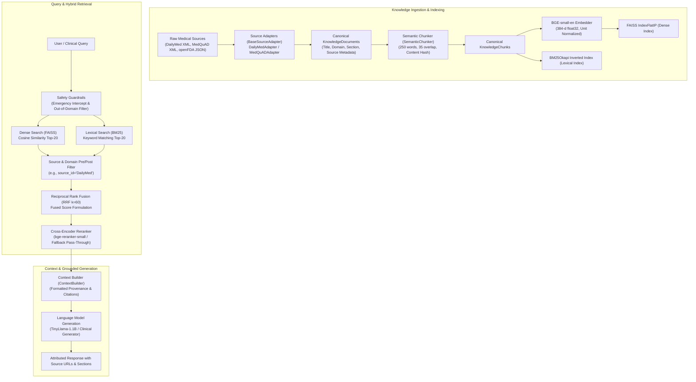

# RAG MODULE V2.5.1 — TECHNICAL ARCHITECTURE SPECIFICATION

## 1. End-to-End Pipeline Architecture

The `rag_module` is a modular, evidence-grounded clinical retrieval and generation pipeline.



---

## 2. Knowledge Ingestion Architecture

### 2.1 Canonical Data Contracts (`rag_module/knowledge/document_model.py`)

#### `KnowledgeDocument`
Represents an atomic medical document extracted from an authoritative source.
* `document_id`: Unique identifier (e.g., `dailymed_4b2c1256..._boxed_warning`).
* `source_id`: Source identifier (e.g., `DailyMed`, `medquad_nih`).
* `source_name`: Full descriptive name (e.g., `National Library of Medicine DailyMed`).
* `publisher`: Authoritative publisher (e.g., `U.S. National Library of Medicine / FDA`).
* `title`: Canonical document title.
* `content`: Full textual content.
* `document_type`: Enum (`drug_monograph`, `qa_pair`, `clinical_guideline`, `reference_article`).
* `medical_domain`: Domain (`pharmacology`, `general_medicine`, `pediatrics`, `oncology`).
* `section`: Clinical section name (*Boxed Warning, Dosage & Administration, Indications, Contraindications, Warnings, Adverse Reactions, Drug Interactions*).
* `source_url`: Verifiable web link.
* `content_hash`: SHA-256 digest of content for exact deduplication.
* `metadata`: Key-value payload (generic name, brand names, active ingredient, NDC code, SPL set ID).

#### `KnowledgeChunk`
Represents an individual retrieval unit generated by `SemanticChunker`.
* `chunk_id`: Standardized chunk key (`<document_id>-c<index>`).
* Inherits all parent document provenance attributes.
* `text`: Passage-formatted text with contextual header (`Drug: ...\nSection: ...\n\n...`).
* `chunk_index`, `word_count`, `char_count`, `content_hash`.

### 2.2 Source Adapter Engine (`rag_module/ingestion/adapters/`)
* **`BaseSourceAdapter`**: Abstract base defining `load_raw()`, `normalize_document()`, `validate_document()`, `deduplicate()`, `generate_manifest()`, and `run()`.
* **`SourceRegistry`**: Central registration registry tracking all active adapters.
* **`IngestionOrchestrator`**: Coordinates multi-source extraction, validation, chunking, and artifact serialization.

---

## 3. Retrieval Architecture

### 3.1 Dense Semantic Retrieval (`rag_module/retrieval/dense_retriever.py`)
* **Embedding Model**: `BAAI/bge-small-en` (384 dimensions).
* **Query Formatting**: Prefixed with `Represent this sentence for searching relevant passages: ` as specified by BGE model guidelines.
* **Vector Index**: `faiss.IndexFlatIP` calculating exact inner product over $L_2$-normalized vectors (equivalent to exact cosine similarity).

### 3.2 Lexical Retrieval (`rag_module/retrieval/bm25_retriever.py`)
* **Algorithm**: BM25Okapi ($k_1=1.5, b=0.75$).
* **Tokenizer**: Custom medical tokenizer preserving numbers, dosages, hyphens, and drug codes: `\b[a-zA-Z0-9_-]+\b`.
* **Inverted Index**: Memory-resident frequency counters with Robertson-Spärck Jones IDF scoring.

### 3.3 Hybrid Fusion (`rag_module/retrieval/hybrid_retriever.py`)
* **Fusion Formulation**: Reciprocal Rank Fusion (RRF) with constant $k=60$:
  $$\text{RRF\_Score}(d) = \sum_{m \in \{\text{Dense}, \text{BM25}\}} \frac{w_m}{k + \text{rank}_m(d)}$$
* **Candidate Pool**: Retrieves top-20 candidates from Dense and top-20 from BM25, returning top-$K$ fused candidates.

### 3.4 Cross-Encoder Reranker (`rag_module/reranking/cross_encoder_reranker.py`)
* **Model**: `BAAI/bge-reranker-small`.
* **Fallback Behavior**: If weights are missing, automatically executes graceful pass-through ranking (`FALLBACK / NOT EXECUTED`) without crashing.

---

## 4. Context Assembly, Citations & Provenance Flow

### Provenance Survival Lifecycle
$$\text{Source Raw XML} \longrightarrow \text{KnowledgeDocument} \longrightarrow \text{KnowledgeChunk} \longrightarrow \text{FAISS/BM25} \longrightarrow \text{ContextBuilder} \longrightarrow \text{Citation}$$

### Output Context Format (`rag_module/context/context_builder.py`)
```markdown
[Doc 1: Lisinopril - Boxed Warning | Section: Boxed Warning | Source: DailyMed]
URL: https://dailymed.nlm.nih.gov/dailymed/drugInfo.cfm?setid=4b2c1256...
Drug: Lisinopril
Section: Boxed Warning

WARNING: FETAL TOXICITY. When pregnancy is detected, discontinue Lisinopril...
```

---

## 5. Safety Guardrails & Emergency Intercept

* **Emergency Crisis Intercept**: Queries indicating acute life-threatening situations (e.g., suicide, acute overdose, anaphylaxis) trigger immediate emergency helpline disclaimers.
* **Out-of-Domain Filter**: Non-medical queries (e.g., coding, physics) are cleanly rejected with an out-of-scope guidance message.

---

## 6. How to Add a New Knowledge Source

Adding a new knowledge source requires zero changes to the retrieval or generation layers:
1. Create a new adapter in `rag_module/ingestion/adapters/<name>_adapter.py` subclassing `BaseSourceAdapter`.
2. Implement `load_raw()` and `normalize_document()` yielding valid `KnowledgeDocument` instances.
3. Register the adapter in `rag_module/ingestion/source_registry.py`.
4. Run `IngestionOrchestrator` to produce standardized artifacts in `rag_module/data/artifacts/<name>/`.
5. Re-run indexing scripts to update vector and lexical stores.

---

## 7. Directory Layout & Key Files

```
rag_module/
├── config/
│   └── rag_config.py             # Centralized configuration
├── knowledge/
│   ├── document_model.py         # KnowledgeDocument & KnowledgeChunk
│   └── source_registry.py        # Source metadata registry
├── ingestion/
│   ├── base_adapter.py           # BaseSourceAdapter abstract contract
│   ├── orchestrator.py           # IngestionOrchestrator
│   └── adapters/
│       ├── dailymed_adapter.py   # DailyMed XML monograph parser
│       ├── medquad_adapter.py    # MedQuAD Q&A parser
│       ├── openfda_adapter.py    # openFDA JSON parser
│       └── guideline_adapter.py  # Guideline parser
├── chunking/
│   └── semantic_chunker.py       # Sliding-window semantic chunker
├── embeddings/
│   └── bge_embedder.py           # BGE-small-en model manager
├── indexing/
│   └── faiss_indexer.py          # FAISS vector index builder
├── retrieval/
│   ├── dense_retriever.py        # Dense FAISS retriever
│   ├── bm25_retriever.py         # BM25Okapi lexical retriever
│   └── hybrid_retriever.py       # RRF hybrid fusion retriever
├── reranking/
│   └── cross_encoder_reranker.py # CrossEncoder with fallback
├── context/
│   └── context_builder.py        # Citation-bearing context constructor
├── safety/
│   └── guardrails.py             # Query validation & emergency filters
├── evaluation/
│   ├── evaluator.py              # Quantitative benchmark runner
│   └── pharmacology_benchmark.json # 45-query pharmacology benchmark
├── rag_pipeline.py               # Unified MedicalRAGPipeline
├── api.py                        # FastAPI REST service
└── tests/                        # 42 unit & integration tests
```
