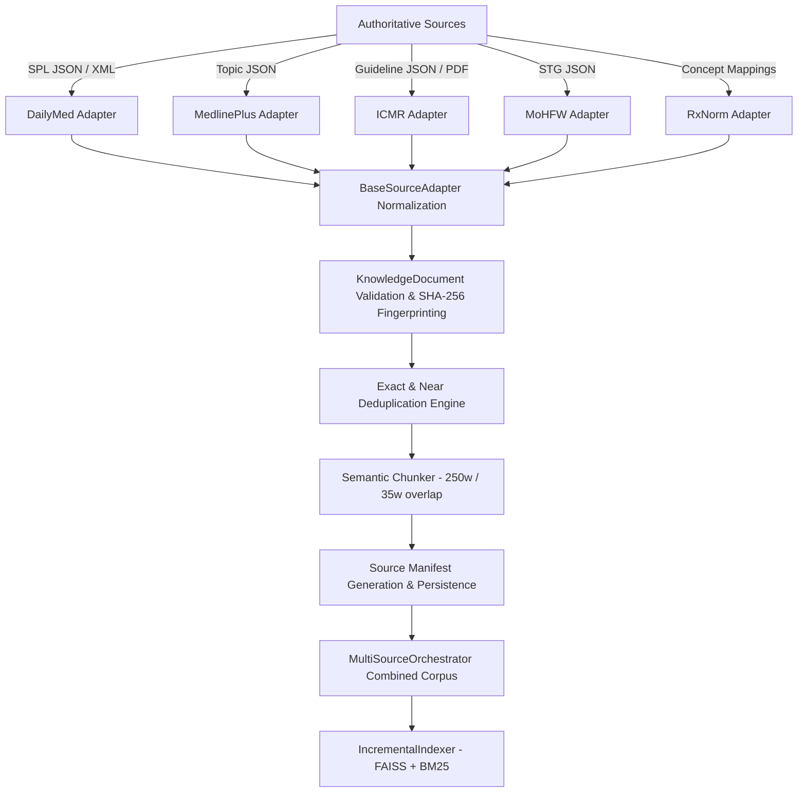

# Data Ingestion & Transformation Pipeline (Phase 24)

## 1. Overview
The Healthcare CDS RAG data ingestion pipeline transforms raw heterogeneous medical sources into normalized, deduplicated, and provenance-tracked knowledge documents and semantic chunks.

---

## 2. Standardized Knowledge Ingestion Workflow

### Step 1: Adapter Extraction & Normalization
Every source implements `BaseSourceAdapter` (`rag_module/ingestion/base_adapter.py`) and standardizes documents into `KnowledgeDocument` instances with mandatory fields:
- `document_id`: Deterministic unique identifier (e.g. `dailymed_<setid>_<section>`)
- `source_id`: Recognized authoritative source string (`DailyMed`, `MedlinePlus`, `ICMR`, `MoHFW_STG`, `RxNorm`, `openFDA`)
- `title`: Document or clinical section title
- `text`: Clean, sanitized clinical narrative
- `source_url`: Verifiable URL linking directly to the official regulatory or institutional publication
- `provenance_status`: Standardized status (`VERIFIED`, `UNVERIFIED`, `TEST_ONLY`, `HISTORICAL`)
- `authority_level`: Provenance tier (`tier_1_regulatory`, `tier_1_federal_research`, `tier_2_clinical_consensus`)
- `content_hash`: SHA-256 hash of title, section, and text

### Step 2: Deduplication
1. **Exact Deduplication**: Documents with identical SHA-256 content hashes are eliminated immediately.
2. **Section Normalization**: Splitting drug monographs into discrete clinical sections (`Boxed Warning`, `Contraindications`, `Warnings & Precautions`, `Drug Interactions`, `Dosage & Administration`, `Use in Specific Populations`) ensures high-density semantic retrieval without intra-document chunk collisions.

### Step 3: Semantic Chunking
- **Algorithm**: `SemanticChunker` preserves clinical section headers and metadata headers (`Drug: <name> Section: <sec>`).
- **Chunk Size**: Target 250 words per chunk with 35 words overlap.
- **Minimum Size Floor**: Chunks under 40 characters or 5 words are discarded to prevent vector hubness artifacts.

### Step 4: Incremental Vector Synchronization
`IncrementalIndexer` (`rag_module/indexing/incremental_indexer.py`) computes a unique cache fingerprint:
$$\text{Fingerprint} = \text{SHA256}(\text{Text} \parallel \text{SourceID} \parallel \text{DocID} \parallel \text{ChunkID} \parallel \text{ModelName})$$
- Unchanged chunks reuse existing 384-dimensional dense vectors from `embeddings_cache.npz`.
- Only new or modified chunks are passed to `BGEEmbedder`, reducing re-indexing latency to milliseconds for incremental updates.
- Synchronizes the FAISS `IndexFlatIP` and BM25 lexical inverted index simultaneously.
