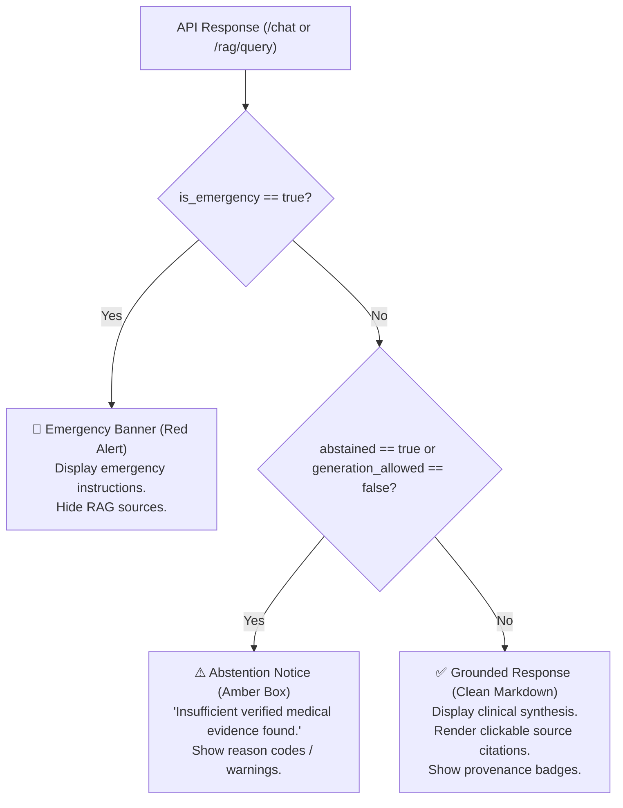

# FRONTEND INTEGRATION CONTRACT & DEVELOPER GUIDE

**Backend System**: Healthcare Clinical Decision Support RAG Intelligence API  
**API Version**: `2.8.0`  
**Base URL**: `http://127.0.0.1:8000`  
**Interactive Swagger Docs**: `http://127.0.0.1:8000/docs`  
**OpenAPI Specification**: `http://127.0.0.1:8000/openapi.json`

---

## 1. BACKEND STARTUP & LOCAL ENVIRONMENT

### Startup Command (from repository root):
```bash
python -m uvicorn rag_module.api:app --host 127.0.0.1 --port 8000 --reload
```

### Verification:
```bash
curl http://127.0.0.1:8000/health
curl http://127.0.0.1:8000/ready
```

---

## 2. CORS CONFIGURATION

The backend includes `CORSMiddleware` pre-configured to allow:
- `http://localhost:3000` (React / Next.js default)
- `http://localhost:5173` (Vite / Vue default)
- `http://127.0.0.1:3000` / `http://127.0.0.1:5173`
- `http://localhost:8080` / `http://127.0.0.1:8080`

All standard HTTP methods (`GET`, `POST`, `OPTIONS`, `HEAD`) and headers are permitted.

---

## 3. CORE ENDPOINTS SUMMARY

| Endpoint | Method | Purpose | Typical Frontend Usage |
|---|---|---|---|
| **`/chat`** | `POST` | Primary conversational CDS endpoint. Returns generated synthesis or safe abstention with source citations. | Patient/Clinician Interactive Chat UI. |
| **`/rag/query`** | `POST` | Structured evidence retrieval & policy contract endpoint. Returns all ranked chunks, provenance metadata, and grounding decisions. | CDS Diagnostic & Evidence Inspection Panel. |
| **`/health`** | `GET` | Service & index health telemetry. | System Status Indicator in UI header. |
| **`/ready`** | `GET` | Readiness probe. | Pre-flight connection check on UI boot. |
| **`/rag/trace`** | `POST` | Forensic diagnostic pipeline breakdown. | Developer / Audit Debug Drawer. |

---

## 4. ENDPOINT CONTRACTS & TYPESCRIPT DEFINITIONS

### 4.1. Conversational Chat (`POST /chat`)

#### Request Payload:
```json
{
  "message": "What are the contraindications for Metformin?",
  "mode": "hybrid",
  "top_k": 3,
  "generate_answer": true
}
```

#### TypeScript Types:
```typescript
export interface ChatRequest {
  message: string;             // User question
  mode?: "dense" | "bm25" | "hybrid" | "hybrid_rerank"; // Default: "hybrid"
  top_k?: number;              // 1 - 100, Default: 5
  generate_answer?: boolean;   // Default: true
}

export interface CitationItem {
  source_index: number;
  title: string;
  source_name: string;
  publisher: string;
  url: string;
  chunk_id: string;
  qtype: string;               // Section name (e.g. "Contraindications")
  score: number;
}

export interface ChatResponse {
  question: string;
  answer: string;              // Synthesized clinical guidance or disclaimer
  is_emergency: boolean;       // True if emergency triage intercepted query
  abstained: boolean;          // True if evidence is insufficient / unsupported
  sources: CitationItem[];     // Explicitly accepted evidence citations
  retrieved_chunks_count: number;
  pipeline_mode: string;
}
```

---

### 4.2. Structured Evidence Retrieval (`POST /rag/query`)

#### Request Payload:
```json
{
  "query": "What are the boxed warnings for Lisinopril?",
  "mode": "hybrid",
  "top_k": 3,
  "source_filter": ["DailyMed"]
}
```

#### TypeScript Types:
```typescript
export interface RAGQueryRequest {
  query: string;
  mode?: "dense" | "bm25" | "hybrid" | "hybrid_rerank";
  top_k?: number;
  source_filter?: string[];
  domain_filter?: string[];
  section_filter?: string[];
}

export interface EvidenceItem {
  chunk_id: string;
  document_id: string;
  title: string;
  section: string;
  source_id: string;
  source_name: string;
  publisher: string;
  source_url: string;
  text: string;
  score: number;
  dense_score?: number;
  bm25_score?: number;
  rerank_score?: number;
}

export interface GroundingContract {
  status: "grounded" | "weak_evidence" | "insufficient_evidence" | "conflicting_evidence";
  generation_allowed: boolean;
  accepted_chunk_ids: string[];
  reason_codes: string[];      // e.g. ["EVIDENCE_SUFFICIENT", "UNSUPPORTED_ENTITY"]
  warnings: string[];
  provenance_valid: boolean;
  conflict_detected: boolean;
}

export interface RAGQueryResponse {
  query: string;
  retrieval_mode: string;
  total_evidence: number;
  evidence: EvidenceItem[];
  context_text: string;
  grounding: GroundingContract;
  citations: CitationItem[];
  latency_ms: number;
}
```

---

## 5. UI DISPLAY STATES & RENDERING LOGIC

The frontend should map the structured response fields directly into clean UI states:



### Specific State Guidelines:

1. **Grounded Answer State** (`is_emergency=false`, `abstained=false`):
   - Render `answer` in Markdown.
   - Render `sources` list as clickable cards with title, publisher badge, and official source URL link.
   - Display `accepted_chunk_ids` badge count.

2. **Abstention State** (`abstained=true` or `grounding.generation_allowed=false`):
   - Display a neutral notice: *"I am not able to find verified medical evidence in authoritative guidelines for this query."*
   - Display any explanatory warnings from `grounding.warnings`.
   - Do **NOT** fabricate plausible-sounding medical advice.

3. **Emergency Crisis State** (`is_emergency=true`):
   - Render high-priority red alert card.
   - Display emergency hotline numbers (911 / 112 / 999).
   - Suppress background RAG citations.

4. **Out of Domain State** (`reason_codes` contains `"OUT_OF_DOMAIN"`):
   - Display: *"This question appears to be outside the supported medical domain."*

---

## 6. ERROR HANDLING CONTRACT

The backend returns clean JSON error payloads without stack traces:

```json
{
  "error": "ValidationError",
  "message": "query: Field required"
}
```

### Status Code Mapping:
- **`200 OK`**: Successful retrieval / chat execution (including controlled clinical abstentions).
- **`400 Bad Request`**: Malformed parameters, unsupported retrieval mode.
- **`422 Unprocessable Entity`**: Missing required fields, invalid JSON structure, empty/whitespace queries.
- **`503 Service Unavailable`**: Indexes not loaded or undergoing rebuild.
- **`500 Internal Error`**: Unhandled runtime exception (fails closed).
