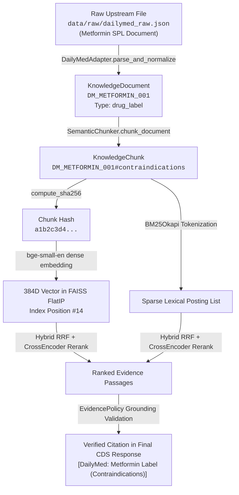

# Authoritative Medical Knowledge Base Catalog (Phase 24)

This document details the authorized, peer-reviewed, and regulatory knowledge bases integrated into the Healthcare Clinical Decision Support System (CDS-RAG).

---

## Registered Knowledge Bases Overview

| Knowledge Base ID | Display Name | Issuing Body / Publisher | Authority Tier | Clinical Role | Primary URL / Identifier |
| :--- | :--- | :--- | :--- | :--- | :--- |
| **`DailyMed`** | FDA Structured Product Labeling (SPL) | NLM / U.S. FDA | Tier 1 Regulatory | Primary Drug Monographs, Boxed Warnings, Dosing & Interactions | `https://dailymed.nlm.nih.gov` |
| **`MedlinePlus`** | MedlinePlus Health Topics & Genetics | NLM / NIH | Tier 1 Federal | General Clinical Information, Patient Explanations, Pathology Overviews | `https://medlineplus.gov` |
| **`ICMR`** | ICMR Clinical Guidelines | Indian Council of Medical Research | Tier 1 National Guideline | India-Specific Clinical Protocols & Treatment Thresholds | `https://main.icmr.nic.in` |
| **`MoHFW_STG`** | MoHFW Standard Treatment Guidelines | Ministry of Health & Family Welfare (India) | Tier 1 National Guideline | Standard Primary & Secondary Healthcare Treatment Workflows | `https://clinicalestablishments.gov.in` |
| **`RxNorm`** | RxNorm Normalized Terminology | NLM | Tier 1 Terminology | Structured Drug Normalization, RxCUI & Ingredient Resolution | `https://www.nlm.nih.gov/research/umls/rxnorm/` |
| **`openFDA`** | FDA Drug Label & Event API | U.S. FDA | Tier 1 Regulatory | Dynamic Label Data & Post-marketing Adverse Event Summaries | `https://open.fda.gov` |
| **`CancerGov`** | National Cancer Institute (NCI) | NIH | Tier 1 Federal | Oncology, Chemotherapy & Staging Protocols | `https://www.cancer.gov` |
| **`GARD`** | Genetic & Rare Diseases Info Center | NCATS / NIH | Tier 1 Federal | Rare Diseases, Genetics & Phenotypes | `https://rarediseases.info.nih.gov` |
| **`NIDDK`** | NIDDK Diabetes & Digestive Diseases | NIH | Tier 1 Federal | Diabetes, Endocrinology & Nephrology | `https://www.niddk.nih.gov` |
| **`NHLBI`** | National Heart, Lung, and Blood Institute | NIH | Tier 1 Federal | Cardiovascular, COPD & Pulmonology | `https://www.nhlbi.nih.gov` |
| **`CDC`** | Centers for Disease Control and Prevention | HHS | Tier 1 Public Health | Infectious Diseases & Vaccination Protocols | `https://www.cdc.gov` |

---

## Detailed Knowledge Base Profiles

### 1. DailyMed (FDA Structured Product Labels)
* **Publisher**: National Library of Medicine (NLM) & U.S. Food and Drug Administration (FDA).
* **Format**: Structured Product Labeling (SPL) XML and JSON Monographs.
* **Corpus Scale (Phase 24)**: 231 authentic drug monographs yielding 2,176 canonical clinical chunks.
* **Preserved Clinical Sections**:
  - `Boxed Warning` (LOINC 34066-1)
  - `Indications & Usage` (LOINC 34067-9)
  - `Dosage & Administration` (LOINC 34068-7)
  - `Contraindications` (LOINC 34070-3)
  - `Warnings & Precautions` (LOINC 42232-9)
  - `Adverse Reactions` (LOINC 34084-4)
  - `Drug Interactions` (LOINC 34073-7)
  - `Use in Specific Populations` (LOINC 43678-2)
* **Traceability Keys**: `set_id`, `ndc_code`, `active_ingredient`, `loinc_code`, `section_title`, `document_id`.

### 2. ICMR Guidelines (Government of India)
* **Publisher**: Indian Council of Medical Research (ICMR).
* **Format**: Evidence-based Clinical Practice Guidelines.
* **Corpus Scale (Phase 24)**: 8 canonical guideline documents covering Type 2 Diabetes management, Antimicrobial Stewardship, Cardiovascular disease, and Community-Acquired Pneumonia.
* **Traceability Keys**: `guideline_title`, `section_name`, `page_number`, `icmr_url`, `document_id`.

### 3. MoHFW Standard Treatment Guidelines (Government of India)
* **Publisher**: Ministry of Health and Family Welfare, Government of India.
* **Format**: Standard Treatment Guidelines (STGs) under the Clinical Establishments Act.
* **Corpus Scale (Phase 24)**: 4 canonical documents covering Primary and Secondary facility workflows for Hypertension, Diabetes, and Emergency Triage.
* **Traceability Keys**: `stg_code`, `condition_name`, `page_number`, `mohfw_url`.

### 4. MedlinePlus (NIH / NLM)
* **Publisher**: National Library of Medicine, National Institutes of Health.
* **Format**: Structured XML / JSON Health Topic Summaries.
* **Corpus Scale (Phase 24)**: 16 clinical condition overviews.
* **Evidence Role**: Complementary patient/condition background context (explicitly differentiated from regulatory drug package inserts).
* **Traceability Keys**: `topic_id`, `mesh_heading`, `official_url`, `section_id`.

### 5. RxNorm Prescribable Content
* **Publisher**: National Library of Medicine (NLM).
* **Format**: Standardized Concept Tables (RxCUI mappings).
* **Architectural Role**: Used strictly for medication name normalization, synonym mapping, and active ingredient resolution. **Not** mixed into prose RAG chunks to artificially inflate chunk count.

---

## Real Document Lineage Example

